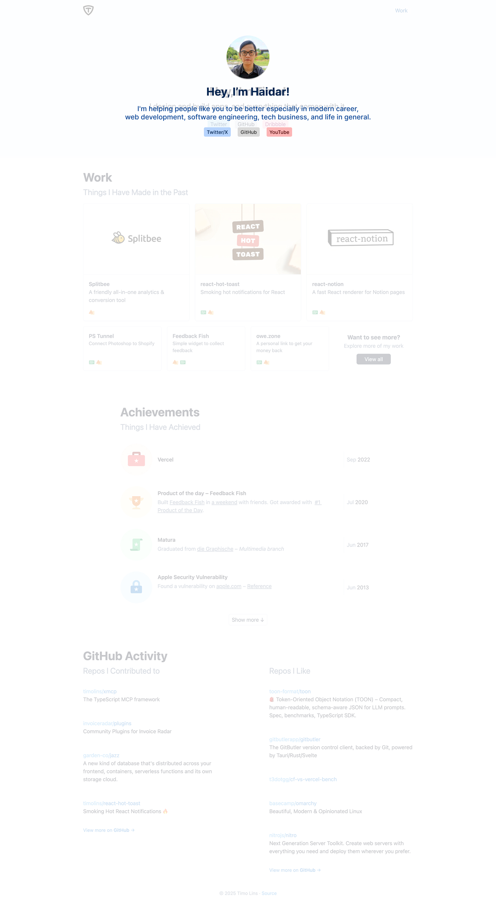

# mhaidarhanif.com

Personal website of M Haidar Hanif for demo in Bearmentor Bootcamp.

I want to show my profile, bio, photo, links, social media, companies, projects, posts, services, and more.

## Links

Check out the site at [mhaidarhanif.com](https://mhaidarhanif.com)

UI design on Figma: <https://www.figma.com/design/FSMjHIqtvhAHf8XXtxPZhL/mhaidarhanif.com>

## Author

I'm a Software Engineer working for the last 15 years.

- Name: M Haidar Hanif
- Nick: Haidar
- Location: Jabodetabek, Indonesia

### Social Media

- Telegram: [t.me/mhaidarhanif](https://t.me/mhaidarhanif)
- LinkedIn: [linkedin.com/in/mhaidarhanif](https://linkedin.com/in/mhaidarhanif)
- GitHub: [github.com/mhaidarhanif](https://github.com/mhaidarhanif)
- Twitter/X: [twitter.com/mhaidarhanif](https://twitter.com/mhaidarhanif)
- Facebook: [facebook.com/mhaidarhanif](https://facebook.com/mhaidarhanif)
- Instagram: [instagram.com/mhaidarhanif\_](https://instagram.com/mhaidarhanif_)
- YouTube: [youtube.com/mhaidarhanif](https://youtube.com/mhaidarhanif)
- CV/Resume: [haidar.dev/resume](https://haidar.dev/resume)

## Pages

- Home
- Contact

## Get Started

1. Open code editor
2. Open live server
3. Check on browser

## Publish/Deploy

...

## Screenshots

